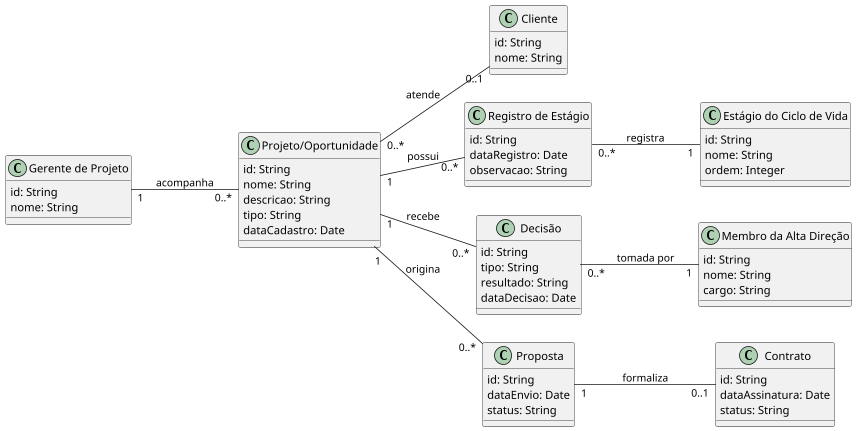

```plantuml
@startuml

left to right direction
scale 0.8

class "Gerente de Projeto" as GerenteProjeto {
    id: String
    nome: String
}

class "Projeto/Oportunidade" as Iniciativa {
    id: String
    nome: String
    descricao: String
    tipo: String
    dataCadastro: Date
}

class Cliente {
    id: String
    nome: String
}

class "Registro de Estágio" as RegistroEstagio {
    id: String
    dataRegistro: Date
    observacao: String
}

class "Estágio do Ciclo de Vida" as EstagioCicloVida {
    id: String
    nome: String
    ordem: Integer
}

class "Decisão" as Decisao {
    id: String
    tipo: String
    resultado: String
    dataDecisao: Date
}

class "Membro da Alta Direção" as MembroAltaDirecao {
    id: String
    nome: String
    cargo: String
}

class Proposta {
    id: String
    dataEnvio: Date
    status: String
}

class Contrato {
    id: String
    dataAssinatura: Date
    status: String
}

GerenteProjeto "1" -- "0..*" Iniciativa : acompanha
Iniciativa "0..*" -- "0..1" Cliente : atende
Iniciativa "1" -- "0..*" RegistroEstagio : possui
RegistroEstagio "0..*" -- "1" EstagioCicloVida : registra
Iniciativa "1" -- "0..*" Decisao : recebe
Decisao "0..*" -- "1" MembroAltaDirecao : tomada por
Iniciativa "1" -- "0..*" Proposta : origina
Proposta "1" -- "0..1" Contrato : formaliza

@enduml
```
