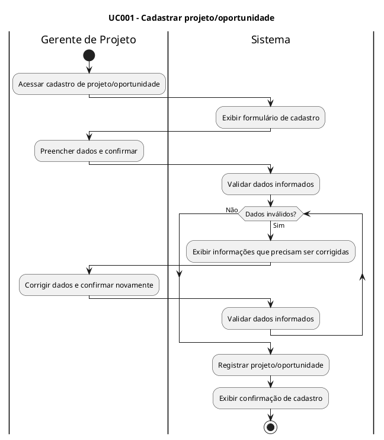
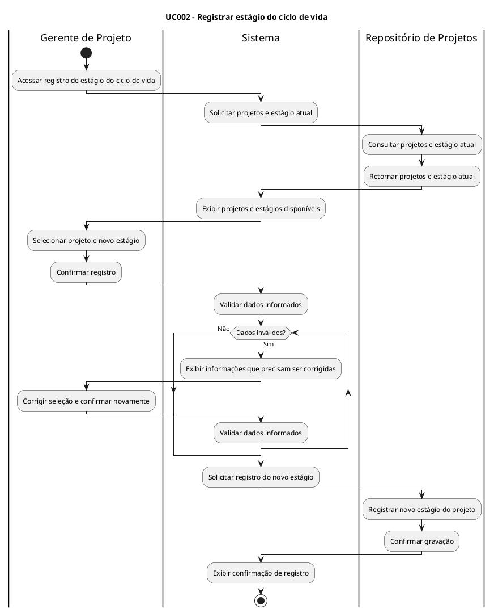

```plantuml
@startuml
title UC001 - Cadastrar projeto/oportunidade

|Gerente de Projeto|
start
:Acessar cadastro de projeto/oportunidade;
|Sistema|
:Exibir formulário de cadastro;
|Gerente de Projeto|
:Preencher dados e confirmar;
|Sistema|
:Validar dados informados;
while (Dados inválidos?) is (Sim)
    :Exibir informações que precisam ser corrigidas;
    |Gerente de Projeto|
    :Corrigir dados e confirmar novamente;
    |Sistema|
    :Validar dados informados;
endwhile (Não)
:Registrar projeto/oportunidade;
:Exibir confirmação de cadastro;
stop
@enduml
```

```plantuml
@startuml
title UC002 - Registrar estágio do ciclo de vida

|Gerente de Projeto|
start
:Acessar registro de estágio do ciclo de vida;
|Sistema|
:Solicitar projetos e estágio atual;
|Repositório de Projetos|
:Consultar projetos e estágio atual;
:Retornar projetos e estágio atual;
|Sistema|
:Exibir projetos e estágios disponíveis;
|Gerente de Projeto|
:Selecionar projeto e novo estágio;
:Confirmar registro;
|Sistema|
:Validar dados informados;
while (Dados inválidos?) is (Sim)
    :Exibir informações que precisam ser corrigidas;
    |Gerente de Projeto|
    :Corrigir seleção e confirmar novamente;
    |Sistema|
    :Validar dados informados;
endwhile (Não)
:Solicitar registro do novo estágio;
|Repositório de Projetos|
:Registrar novo estágio do projeto;
:Confirmar gravação;
|Sistema|
:Exibir confirmação de registro;
stop
@enduml
```
