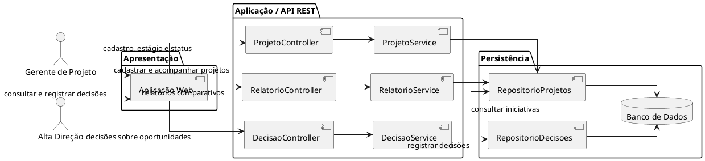

```plantuml
@startuml
left to right direction
skinparam componentStyle uml2
skinparam shadowing false
skinparam linetype ortho

actor "Gerente de Projeto" as Gerente
actor "Alta Direção" as Direcao

package "Apresentação" {
    component "Aplicação Web" as Web
}

package "Aplicação / API REST" {
    component "ProjetoController" as ProjetoController
    component "RelatorioController" as RelatorioController
    component "DecisaoController" as DecisaoController

    component "ProjetoService" as ProjetoService
    component "RelatorioService" as RelatorioService
    component "DecisaoService" as DecisaoService
}

package "Persistência" {
    component "RepositorioProjetos" as RepositorioProjetos
    component "RepositorioDecisoes" as RepositorioDecisoes
    database "Banco de Dados" as Banco
}

Gerente --> Web : cadastrar e acompanhar projetos
Direcao --> Web : consultar e registrar decisões

Web --> ProjetoController : cadastro, estágio e status
Web --> RelatorioController : relatórios comparativos
Web --> DecisaoController : decisões sobre oportunidades

ProjetoController --> ProjetoService
RelatorioController --> RelatorioService
DecisaoController --> DecisaoService

ProjetoService --> RepositorioProjetos
RelatorioService --> RepositorioProjetos
DecisaoService --> RepositorioProjetos : consultar iniciativas
DecisaoService --> RepositorioDecisoes : registrar decisões

RepositorioProjetos --> Banco
RepositorioDecisoes --> Banco

@enduml
```